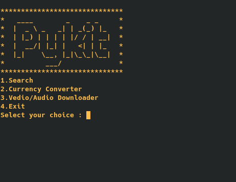
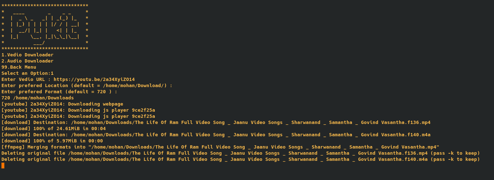

# Pykit

## Table of Contents
* [General info](#general-info)
* [Technologies](#technologies)
* [Setup](#setup)
* [Search](#search)
* [Currency_Convertion](#Currency_Convertion)
* [Youtube_Vedio/Audio_Downloader](#youtube_vedio/audio_downloader)

## General-Info
This project mainly focus on making terminal as browser this module supports searching the google and bing results in terminal,this module alo supports vedio and audio download of any vedio in the youtube vedio using the URL of the vedio and also support currency converson between any country.

## Technologies
Project was created using:
* Python : 3.X
* Currency Exchange : This is a free api service for currency covertion to get your own API id follow to this [link](https://rapidapi.com/fyhao/api/currency-exchange)
* youtube-dl : This is a open-source which is available in Github also and this file is used for Downloading the vedio and audio of youtube vedios.

## Setup
To run the program
```
git clone https://github.com/Mohan9182/pykit.git
cd ~/pykit
python3 main.py
```


## Search
Pykit allows users to search in terminal.Pykit supports Google and Bing search engine results to be deplayed in terminal and user can follow the link for more information.


## Currency_Convertion
Pykit currency convertor can be used for coverting any country currency to any another currency.If the user is not familiar with country codes then he can select country codes option and see the country codes of upto 200 countries.


The user can choice the amount for convertion and can select from which currency to which using the currency codes.


## Youtube_Vedio/Audio_Downloader
Pykit allows user to download any vedio or audio of a youtube using URL of the vedio.User can any of the option as they prefered and download the vedio/audio using URL and get also select default location and also prefered format like 480p,720p .... even 4K if the vedio is avaliable.

